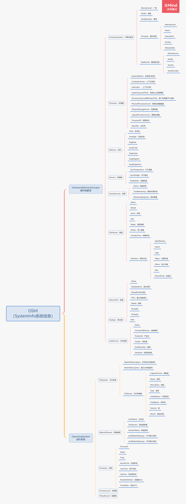

# OSHI

OSHI是Java的免费基于JNA的（本机）操作系统和硬件信息库。它不需要安装任何其他本机库，并且旨在提供一种跨平台的实现来检索系统信息，例如操作系统版本，进程，内存和CPU使用率，磁盘和分区，设备，传感器等。

使用OSHI我们可以对应用程序进行监控，可以对应用程序所在的服务器资源进行监控，可以监控到很多的指标，如下：

```
1、计算机系统和固件，底板
2、操作系统和版本/内部版本
3、物理（核心）和逻辑（超线程）CPU，处理器组，NUMA节点
4、系统和每个处理器的负载百分比和滴答计数器
5、CPU正常运行时间，进程和线程
6、进程正常运行时间，CPU，内存使用率，用户/组，命令行
7、已使用/可用的物理和虚拟内存
8、挂载的文件系统（类型，可用空间和总空间）
9、磁盘驱动器（型号，序列号，大小）和分区
10、网络接口（IP，带宽输入/输出）
11、电池状态（电量百分比，剩余时间，电量使用情况统计信息）
12、连接的显示器（带有EDID信息）
13、USB设备
14、传感器（温度，风扇速度，电压）
```

官方API地址[http://oshi.github.io/oshi/apidocs/](http://oshi.github.io/oshi/apidocs/)

---
## 配置 `pom` 依赖
```xml
<dependency>
    <groupId>com.github.oshi</groupId>
    <artifactId>oshi-core</artifactId>
    <version>3.9.1</version>
</dependency>

<dependency>
    <groupId>cn.hutool</groupId>
    <artifactId>hutool-core</artifactId>
    <version>5.6.3</version>
</dependency>

<dependency>
    <groupId>org.projectlombok</groupId>
    <artifactId>lombok</artifactId>
</dependency>
```
--- 
## 编写具体实体类
```java
package com.blaife.oshi.entity.server;

import cn.hutool.core.util.NumberUtil;
import lombok.Data;

import java.io.Serializable;

/**
 * @author Blaife
 * @description Cpu 实体类
 * @date 2021/4/24 21:33
 */

@Data
public class Cpu implements Serializable {

    private static final long serialVersionUID = 1L;

    /**
     * 核心数
     */
    private int cpuNum;

    /**
     * CPU 总使用率
     */
    private double total;

    /**
     * CPU 系统使用率
     */
    private double sys;

    /**
     * CPU 用户使用率
     */
    private double used;

    /**
     * CPU 当前等待率
     */
    private double wait;

    /**
     * CPU 当前空闲率
     */
    private double free;

    public double getTotal() {
        return NumberUtil.round(NumberUtil.mul(total, 100), 2).doubleValue();
    }

    public double getSys() {
        return NumberUtil.round(NumberUtil.mul(sys / total, 100), 2).doubleValue();
    }

    public double getUsed() {
        return NumberUtil.round(NumberUtil.mul(used / total, 100), 2).doubleValue();
    }

    public double getWait() {
        return NumberUtil.round(NumberUtil.mul(wait / total, 100), 2).doubleValue();
    }

    public double getFree() {
        return NumberUtil.round(NumberUtil.mul(free / total,100), 2).doubleValue();
    }

    @Override
    public String toString() {
        return "Cpu ：{" +
                "\n\t核心数 ： " + cpuNum +
                ",\n\t总使用率 ： " + total +
                ",\n\t系统使用率 ： " + sys +
                ",\n\t用户使用率 ： " + used +
                ",\n\t当前等待率 ： " + wait +
                ",\n\t当前空闲率 ： " + free +
                "\n}";
    }
}
```
```java
package com.blaife.oshi.entity.server;

import cn.hutool.core.util.NumberUtil;
import lombok.Data;

import java.io.Serializable;

/**
 * @author blaife
 * @description Men 内存实体类
 * @date 2021/4/25 21:18
 */
@Data
public class Mem implements Serializable {

    /**
     * 内存总量
     */
    private double total;

    /**
     * 已用内存
     */
    private double used;

    /**
     * 剩余内存
     */
    private double free;

    public double getTotal() {
        return NumberUtil.div(total, (1024 * 1024 * 1024), 2);
    }

    public double getUsed() {
        return NumberUtil.div(used, (1024 * 1024 * 1024), 2);
    }

    public double getFree() {
        return NumberUtil.div(free, (1024 * 1024 * 1024), 2);
    }

    /**
     * 使用占比
     * @return
     */
    public double getUsage() {
        return NumberUtil.mul(NumberUtil.div(used, total, 4), 100);
    }

    @Override
    public String toString() {
        return "Mem ：{" +
                "\n\t内存总量 ： " + total +
                ",\n\t已用内存=" + used +
                ",\n\t剩余内存=" + free +
                ",\n\t使用占比=" + getUsage() +
                "\n}";
    }
}
```
```java
package com.blaife.oshi.entity.server;

import lombok.Data;

import java.io.Serializable;

/**
 * @author blaife
 * @description Sys 系统实体类
 * @date 2021/4/25 21:27
 */
@Data
public class Sys implements Serializable {

    private static final long serialVersionUID = 1L;

    /**
     * 服务器名称
     */
    private String computerName;

    /**
     * 服务器IP
     */
    private String computerIp;

    /**
     * 项目路径
     */
    private String userDir;

    /**
     * 操作系统
     */
    private String osName;

    /**
     * 系统架构
     */
    private String osArch;

    @Override
    public String toString() {
        return "Sys ：{" +
                "\n\t服务器名称 ：" + computerName +
                ",\n\t服务器IP ：" + computerIp +
                ",\n\t项目路径 ：" + userDir +
                ",\n\t操作系统 ：" + osName +
                ",\n\t系统架构 ：" + osArch +
                "\n}";
    }
}
```
```java
package com.blaife.oshi.entity.server;

import cn.hutool.core.date.DateUnit;
import cn.hutool.core.date.DateUtil;
import cn.hutool.core.util.NumberUtil;
import lombok.Data;

import java.io.Serializable;
import java.lang.management.ManagementFactory;
import java.util.Date;

/**
 * @author blaife
 * @description Jvm 实体类
 * @date 2021/4/24 22:01
 */
@Data
public class Jvm implements Serializable {

    private static final long serialVersionUID = 1L;

    /**
     * 当前 JVM 占用的内存总数 (M)
     */
    private double total;

    /**
     * JVM 最大可用内存总数 (M)
     */
    private double max;

    /**
     * JVM 空闲内存 (M)
     */
    private double free;

    /**
     * JDK 版本
     */
    private String version;

    /**
     * JDK 路径
     */
    private String home;

    public double getTotal() {
        return NumberUtil.div(total, (1024 * 1024), 2);
    }

    public double getMax() {
        return NumberUtil.div(max, (1024 * 1024), 2);
    }

    public double getFree() {
        return NumberUtil.div(free, (1024 * 1024), 2);
    }

    /**
     * JVM内存使用占比
     */
    public double getUsage() {
        return NumberUtil.mul(NumberUtil.div(total - free, total, 4), 100);
    }

    /**
     * 获取 JDK 名称
     */
    public String getName() {
        return ManagementFactory.getRuntimeMXBean().getVmName();
    }

    /**
     * 获取 JDK 启动时间
     */
    public String getStartTime() {
        long time = ManagementFactory.getRuntimeMXBean().getStartTime();
        Date date = new Date(time);
        return DateUtil.formatDateTime(date);
    }

    /**
     * 获取运行时长
     */
    public String getRunTime() {
        // 启动时间
        long time = ManagementFactory.getRuntimeMXBean().getStartTime();
        Date date = new Date(time);

        // 运行了多长时间 ms（毫秒）
        long runMS = DateUtil.between(date, new Date(), DateUnit.MS);

        // 一天的毫秒数
        long nd = 1000 * 24 * 60 * 60;
        // 一小时的毫秒数
        long nh = 1000 * 60 * 60;
        // 一分钟的毫秒数
        long nm = 1000 * 60;

        long day = runMS / nd;
        long hour = runMS % nd / nh;
        long min = runMS % nd % nh / nm;

        return day + "天" + hour + "小时" + min + "分钟";
    }

    /**
     * 运行时常（MS）
     * @return
     */
    public long getRunTimeForMS() {
        // 启动时间
        long time = ManagementFactory.getRuntimeMXBean().getStartTime();
        Date date = new Date(time);

        // 运行了多长时间 ms（毫秒）
        return DateUtil.between(date, new Date(), DateUnit.MS);
    }

    @Override
    public String toString() {
        return "Jvm ：{" +
                "\n\t当前 JVM 占用的内存总数 (M) ： " + total +
                ", \n\tJVM 最大可用内存总数 (M) ： " + max +
                ", \n\tJVM 空闲内存 (M) ： " + free +
                ", \n\tJDK 版本 ： " + version +
                ", \n\tJDK 路径 ： " + home +
                ", \n\tJVM 内存使用占比 ： " + getUsage() +
                ", \n\tJDK 名称 ： " + getName() +
                ", \n\tJDK 启动时间 ： " + getStartTime() +
                ", \n\tJDK 运行时长 ： " + getRunTime() +
                ", \n\tJDK 运行时长（MS） ： " + getRunTimeForMS() +
                "\n}";
    }
}
```
```java
package com.blaife.oshi.entity.server;

import lombok.Data;

/**
 * @author blaife
 * @description SysFile 系统文件实体类
 * @date 2021/4/25 21:35
 */
@Data
public class SysFile {

    private static final long serialVersionUID = 1L;

    /**
     * 盘符路径
     */
    private String dirName;

    /**
     * 盘符类型
     */
    private String sysTypeName;

    /**
     * 文件类型
     */
    private String typeName;

    /**
     * 总大小
     */
    private String total;

    /**
     * 剩余大小
     */
    private String free;

    /**
     * 已使用大小
     */
    private String used;

    /**
     * 资源使用率
     */
    private double usage;

    @Override
    public String toString() {
        return "\n\tSysFile ： {" +
                "\n\t\t盘符路径 ： " + dirName +
                ",\n\t\t盘符名称 ：" + sysTypeName +
                ",\n\t\t文件类型 ：" + typeName +
                ",\n\t\t总大小 ：" + total +
                ",\n\t\t剩余大小 ：" + free +
                ",\n\t\t已使用大小 ：" + used +
                ",\n\t\t资源使用率 ：" + usage +
                "\n\t}\n";
    }
}
```

---
## 主程序装载类
```java
package com.blaife.oshi.entity;

import cn.hutool.core.util.NumberUtil;
import com.blaife.oshi.entity.server.*;
import lombok.Data;
import oshi.SystemInfo;
import oshi.hardware.CentralProcessor;
import oshi.hardware.CentralProcessor.TickType;
import oshi.hardware.GlobalMemory;
import oshi.hardware.HardwareAbstractionLayer;
import oshi.software.os.FileSystem;
import oshi.software.os.OSFileStore;
import oshi.software.os.OperatingSystem;
import oshi.util.Util;


import java.io.Serializable;
import java.net.InetAddress;
import java.net.UnknownHostException;
import java.util.LinkedList;
import java.util.List;
import java.util.Properties;

/**
 * @author blaife
 * @description 主程序类
 * @date 2021/4/24 22:25
 */
@Data
public class MainServer implements Serializable {

    private static final long serialVersionUID = 1L;

    /**
     * 休眠时间
     */
    private static final int OSHI_WAIT_SECOND = 1000;

    private Cpu cpu = new Cpu();

    private Mem mem = new Mem();

    private Sys sys = new Sys();

    private Jvm jvm = new Jvm();

    private List<SysFile> sysFiles = new LinkedList<>();


    /**
     * 入口方法
     */
    public void copyTo() {
        // 系统信息
        SystemInfo si = new SystemInfo();
        // 硬件抽象层
        HardwareAbstractionLayer hal = si.getHardware();

        // 载入CPU信息
        setCpuInfo(hal.getProcessor());

        // 载入内存信息
        setMemInfo(hal.getMemory());

        // 载入系统信息
        setSysInfo();

        // 载入JVM信息
        setJvmInfo();

        // 载入系统文件信息
        setSysFiles(si.getOperatingSystem());
    }

    /**
     * 载入CPU信息
     * @param processor 中央处理器
     */
    private void setCpuInfo(CentralProcessor processor) {
        long[] prevTicks = processor.getSystemCpuLoadTicks();
        Util.sleep(OSHI_WAIT_SECOND);
        long[] ticks = processor.getSystemCpuLoadTicks();
        long nice = ticks[TickType.NICE.getIndex()] - prevTicks[TickType.NICE.getIndex()];
        long irq = ticks[TickType.IRQ.getIndex()] - prevTicks[TickType.IRQ.getIndex()];
        long softirq = ticks[TickType.SOFTIRQ.getIndex()] - prevTicks[TickType.SOFTIRQ.getIndex()];
        long steal = ticks[TickType.STEAL.getIndex()] - prevTicks[TickType.STEAL.getIndex()];
        long cSys = ticks[TickType.SYSTEM.getIndex()] - prevTicks[TickType.SYSTEM.getIndex()];
        long user = ticks[TickType.USER.getIndex()] - prevTicks[TickType.USER.getIndex()];
        long iowait = ticks[TickType.IOWAIT.getIndex()] - prevTicks[TickType.IOWAIT.getIndex()];
        long idle = ticks[TickType.IDLE.getIndex()] - prevTicks[TickType.IDLE.getIndex()];
        long totalCpu = user + nice + cSys + idle + iowait + irq + softirq + steal;
        cpu.setCpuNum(processor.getLogicalProcessorCount());
        cpu.setTotal(totalCpu);
        cpu.setSys(cSys);
        cpu.setUsed(user);
        cpu.setWait(iowait);
        cpu.setFree(idle);
    }

    /**
     * 载入Mem内存信息
     * @param memory 全局内存
     */
    private void setMemInfo(GlobalMemory memory) {
        mem.setTotal(memory.getTotal());
        mem.setUsed(memory.getTotal() - memory.getAvailable());
        mem.setFree(memory.getAvailable());
    }

    /**
     * 载入Sys服务器信息
     */
    private void setSysInfo() {
        // 系统配置文件
        Properties props = System.getProperties();
        // 服务器名称
        String computerName = "";
        // 服务器IP
        String computerIp = "";
        try {
            computerName = InetAddress.getLocalHost().getHostName();
            computerIp = InetAddress.getLocalHost().getHostAddress();
        } catch (UnknownHostException e) {
            e.printStackTrace();
        }
        sys.setComputerName(computerName);
        sys.setComputerIp(computerIp);
        sys.setOsName(props.getProperty("os.name"));
        sys.setOsArch(props.getProperty("os.arch"));
        sys.setUserDir(props.getProperty("user.dir"));
    }

    /**
     * 载入Java虚拟机信息
     */
    private void setJvmInfo() {
        // 系统配置文件
        Properties props = System.getProperties();
        jvm.setTotal(Runtime.getRuntime().totalMemory());
        jvm.setMax(Runtime.getRuntime().maxMemory());
        jvm.setFree(Runtime.getRuntime().freeMemory());
        jvm.setVersion(props.getProperty("java.version"));
        jvm.setHome(props.getProperty("java.home"));
    }

    /**
     * 载入SysFiles磁盘信息
     * @param os 操作系统
     */
    private void setSysFiles(OperatingSystem os) {
        FileSystem fileSystem = os.getFileSystem();
        OSFileStore[] fsArray = fileSystem.getFileStores();
        for (OSFileStore fs : fsArray) {
            long free = fs.getUsableSpace();
            long total = fs.getTotalSpace();
            long used = total - free;
            SysFile sysFile = new SysFile();
            sysFile.setDirName(fs.getMount());
            sysFile.setSysTypeName(fs.getType());
            sysFile.setTypeName(fs.getName());
            sysFile.setTotal(convertFileSize(total));
            sysFile.setFree(convertFileSize(free));
            sysFile.setUsed(convertFileSize(used));
            sysFile.setUsage(NumberUtil.round(NumberUtil.mul(used, total, 4), 100).doubleValue());
            sysFiles.add(sysFile);
        }
    }


    /**
     * 字节转换
     * @param size 字节大小
     * @return 转换后值
     */
    public String convertFileSize(long size) {
        long kb = 1024;
        long mb = kb * 1024;
        long gb = mb * 1024;
        if (size >= gb) {
            return String.format("%.1f GB" , (float) size / gb);
        } else if (size >= mb) {
            float f = (float) size / mb;
            return String.format(f > 100 ? "%.0f MB" : "%.1f MB" , f);
        } else if (size >= kb) {
            float f = (float) size / kb;
            return String.format(f > 100 ? "%.0f KB" : "%.1f KB" , f);
        } else {
            return String.format("%d B" , size);
        }
    }

}
```

---
## 进行测试

```java
package com.blaife.oshi;

import com.blaife.oshi.entity.MainServer;
import org.junit.jupiter.api.Test;
import org.springframework.boot.test.context.SpringBootTest;

@SpringBootTest
class DemoMonitoringOshiApplicationTests {

    @Test
    void contextLoads() {

    }

    /**
     * 测试方法
     */
    @Test
    void firstAttempt() {
        MainServer sys = new MainServer();
        sys.copyTo();
        System.out.println(sys.getCpu());
        System.out.println(sys.getJvm());
        System.out.println(sys.getMem());
        System.out.println(sys.getSys());
        System.out.println(sys.getSysFiles());
    }
}
```
正常结果下，输出内容如下：
```text
Cpu ：{
	核心数 ： 16,
	总使用率 ： 15986.0,
	系统使用率 ： 124.0,
	用户使用率 ： 79.0,
	当前等待率 ： 0.0,
	当前空闲率 ： 15781.0
}
Jvm ：{
	当前 JVM 占用的内存总数 (M) ： 1.71966464E8, 
	JVM 最大可用内存总数 (M) ： 3.666870272E9, 
	JVM 空闲内存 (M) ： 1.0819852E8, 
	JDK 版本 ： 1.8.0_191, 
	JDK 路径 ： C:\Program Files\Java\jdk1.8.0_191\jre, 
	JVM 内存使用占比 ： 37.08, 
	JDK 名称 ： Java HotSpot(TM) 64-Bit Server VM, 
	JDK 启动时间 ： 2021-04-25 22:08:39, 
	JDK 运行时长 ： 0天0小时0分钟, 
	JDK 运行时长（MS） ： 3807
}
Mem ：{
	内存总量 ： 1.6499134464E10,
	已用内存=7.863058432E9,
	剩余内存=8.636076032E9,
	使用占比=47.66
}
Sys ：{
	服务器名称 ：LAPTOP-JVNUVTDI,
	服务器IP ：192.168.0.105,
	项目路径 ：D:\project\spring-boot-study\demo-monitoring-oshi,
	操作系统 ：Windows 10,
	系统架构 ：amd64
}
[
	SysFile ： {
		盘符路径 ： C:\,
		盘符名称 ：NTFS,
		文件类型 ：本地固定磁盘 (C:),
		总大小 ：200.0 GB,
		剩余大小 ：145.0 GB,
		已使用大小 ：55.0 GB,
		资源使用率 ：5.074679185014828E22
	}
, 
	SysFile ： {
		盘符路径 ： D:\,
		盘符名称 ：NTFS,
		文件类型 ：本地固定磁盘 (D:),
		总大小 ：275.7 GB,
		剩余大小 ：249.8 GB,
		已使用大小 ：25.9 GB,
		资源使用率 ：3.2907600358577617E22
	}
]
```

## 更多内容

实例可于[whole](src/main/java/com/blaife/oshi/entity/whole)中查看。

